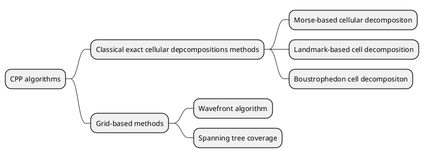

# CPP算法综述

```puml
@startmindmap
* CPP algorithms
** Classical exact cellular depcompositions methods
*** Morse-based cellular decompositon
*** Landmark-based cell decomposition
*** Boustrophedon cell decompositon
** Grid-based methods
*** Wavefront algorithm
*** Spanning tree coverage
@endmindmap
```