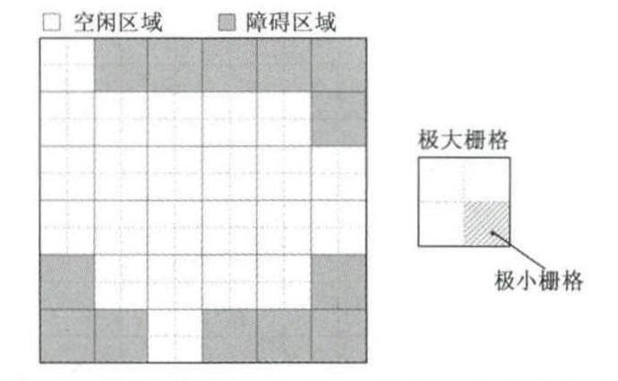
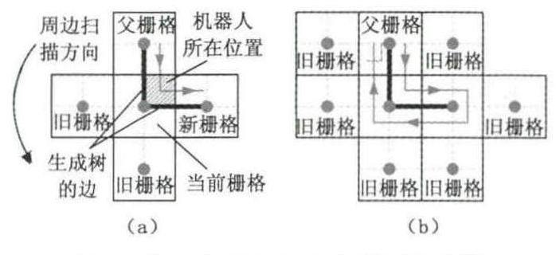

# 全覆盖路径规划（CCPP）
## 基本概念
CPP：Complete Coverage Path Planning
CPP需解决的问题：
* 遍历工作区域内除障碍物以外的全部区域
* 在遍历过程中有效避开所有障碍物
* 在遍历过程中要尽量避免路径重复，缩短移动距离
* 目标：A path： collision-free, pass through all points in a confined area, less computation，allows for both closed and non-closed path
## 问题特征
* online/offline: online指机器人对于环境信息是未知的；offline反之。
## CPP评价指标
* 区域覆盖率
* 路径重复率
* 行程时间
* 转弯次数
* 能量消耗

## 最优问题
**SCP**: Set Covering Problem, 问题描述：给定全集$\mathrm{U}$，以及一个包含n个集合且这n集合的并集为全集的集合$\mathrm{S}$ 。集合覆盖问题要找到$\mathrm{S}$的一个最小的子集，使得他们的并集等于全集。Area Coverage
**TSP**: TSM，即Traveling SalesMan problem，也就是旅行商问题，简称为TSP问题，也简称为TSM问题，是最基本的路线规划问题，也是一个经典的NP-Hard问题。该问题是在寻求单一旅行者由起点出发，通过所有给定的需求点之后，最后再回到原点的最小路径成本。Target coverage， discrete

## Spanning Tree Coverage(STC)
> The spanning-tree coverage (STC) based CPP algorithm subdivides the workspace into a finite sequence of disjoint cells, either by cell decomposition-based method or grid-based method

该算法采用了两种栅格,一种是边长为2倍机器人覆盖幅宽的“极大栅格”,而每个“极大栅格”又被等分成4个等大的、边长为覆盖幅宽的“极小栅格”,若“极大栅格”中包含障碍区域,那么此栅格将被整体视作障碍栅格。

"极大栅格"和"极小栅格"的划分方法
如下图所示，机器人处于当前栅格x，按逆时针方向扫描周边栅格，获取未经覆盖的“新栅格”，已被覆盖过的栅格称作“旧栅格”，当捕获到第一个新栅格时，连接当前栅格与新栅格的中心点。形成“生成树”的边，机器人沿着生成树的边进入新栅格。如此往复，当周边无新栅格时停止前向探索，此时机器人沿着已有生成树的边往回进行覆盖，沿途继续扫描周边栅格，若捕获“新栅格”，则继续生成边，直至完成覆盖。

STC算法原理图

生成的覆盖路径最长为(n+m)D，其中n为地图生成的总栅格数，m为边界栅格(与地图边界至少共享一点)数，D为机器人覆盖幅宽。

> 一般的STC(spiral-STC)对于障碍物附近的区域做不到很好的覆盖，因为其在构建生成树时会将那些部分被障碍物占据的区域忽略掉，然而这样会导致对于区域的覆盖率降低，于是考虑增加对障碍物附近区域的覆盖策略，在Spiral-STC的基础上提出full Spiral-STC算法。
full Spiral-STC在构造生成树时会将部分被占据的栅格(至少有一个obstacle-free的子栅格)考虑在内。由此会产生两种类型的生成树边。
* single-sided edges

* double-sided edges

full Spiral-STC同样会在以上这两种区域构造生成树，但是在生成路径时，在这些区域会不可避免地产生路径重复。从生成树构造来看，full Spiral-STC算法与原本的Spiral-STC算法是相同的，而在考虑构造生成树边时full Spiral-STC将被障碍物部分占据的区域添加了进来，二者的最大不同点在于full Spiral-STC算法基于以上提到的两种新增类型的生成树边设计了新的路径生成策略。
* 对于single-sided edges：

* 对于double-sided edges：

我们可以注意到，double-sided edges并不会产生路径重复。
两个版本的STC算法实例如下：

## Dynamic Programming
$\mathcal{T}$(seabed type)      海洋区域：$\mathcal{O}_{m n}$ 机器人位置描述：$\mathbf((i, j), dir)$
区域被检测到的条件概率为$p^{\text {scan }}\left(d(x,y,i,j), \mathbf{o}_{i j}\right)$
覆盖矩阵$\mathbf{C},\mathbf{C}_{i j}$为$(i, j)$处被覆盖的条件概率，$\mathbf{C}_{i j}$不被检测的概率为$1-\mathbf{C}_{i j}$。对于$\mathbf{C}_{i j}^{\prime}$，其更新式为：
$$\mathbf{C}_{i j}^{\prime}=1-(1-\mathbf{C}_{i j})(1-p^{\text {scan }}\left(d(x,y,i,j), \mathbf{o}_{i j}\right))=\mathbf{C}_{i j}+(1-\mathbf{C}_{i j})p^{\text {scan }}(d(x,y,i,j), \mathbf{o}_{i j})$$
最小要求覆盖矩阵$\mathbf{D}$，$\mathbf{D}_{i j}$为$(i, j)$处必须达到的覆盖概率。
> $CPP with imperfect extended detection (CPPIED)$
### 基于DP和TSP的混合算法
算法构成：
1. 生成一系列子路径，满足最小覆盖率。构造一组收益$(\mathbf{H}^{*},\mathbf{V}^{*})$最大的水平线段或水平线段并将其添加至$\mathbf{S}$，直至$\mathbf{S}$满足$\mathbf{D} \leq \mathbf{C}$。
2. 通过$\mathbf{TSP}$算法连接各子路径，使得生成一条满足覆盖要求的最短路径。
#### 1. Greedily choose a set of segments $S$
由于传感器范围的扩大，同一栅格可能被多次覆盖，为了解决这种问题，再每个segments之间添加一个$2r$($r$为传感器侧向扫描范围)的约束。
水平增益$\mathbf{H}_{i j}$：更新检测概率(距离为$k$个栅格)$\mathbf{p}^{c}(i,j,k)=\mathbf{C}_{i j}+(1-\mathbf{C}_{i j})p^{\text {scan }}(d(x,y,i,j), \mathbf{o}_{i j})$，从$(i,j)$处扫描距离为$k$处的栅格得到的增益为：
$$g(i, j, k)=\left\{\begin{array}{ll}
\min \left\{\mathbf{D}_{i j},\right. \left.p^{\mathrm{C}}(i, j, k)\right\}-\mathbf{C}_{i j} & \mathbf{C}_{i j}<\mathbf{D}_{i j} \\
-\lambda & \mathbf{C}_{i j} \geq \mathbf{D}_{i j}
\end{array}\right.$$
* $(i,j)$处未被覆盖时，增益$g(i, j, k)$等于为了达到要求概率的增量。
* $(i,j)$处若已被覆盖时，则给予惩罚$-\lambda$(过覆盖)。
定义$(i,j)$处扫描范围为$r$的水平覆盖增益为：
$$G(i, j)=\sum_{k=1}^{r} g(i-k+1, j, k)+\sum_{k=1}^{r} g(i+k, j, k)$$
因为需要找到最短的高覆盖子路径，子路径应该在遇到第一个$G(i,j) \leq 0$的栅格时停止，于是水平覆盖增益$\mathbf{H}_{i j}$定义为：
$$\mathbf{H}_{i j}=\left\{\begin{array}{ll}
G(i, j) & G(i, j)>0 \\
-\infty & G(i, j) \leq 0
\end{array}\right.$$
对于端点为$a, b$的行，其最大增益为：${K}({h}_{i})=\max _{a, b} \sum_{j=a}^{b} \mathbf{H}_{i j}$(最大子序列和问题)
最优水平子路径集：
$$\max _{I \subset\{1 . . m\}\left|i, i^{\prime} \in I \Rightarrow\right| i-i^{\prime} \mid \geq 2 r} \sum_{i \in I} K\left(h_{i}\right) .$$
使用如下的递推关系计算最优水平子路径集：
$$\mathbf{h}^{*}{ }_{i}=\left\{\begin{array}{ll}
K\left(h_{i}\right) & 1 \leq i \leq 2 r \\
\max \left\{\mathbf{h}^{*}{ }_{i-1},K\left(h_{i}\right)+\mathbf{h}^{*}{ }_{i-2 r}\right\} & 2 r<i \leq m
\end{array}\right.$$

#### 2. Reducing to a TSP and Restructing the path P
${V(G)}$：节点集      
${\varepsilon(G)}$：边集
$c(e)$：代价函数
对于$S$中的每个子路径，其端点为$u_{i},w_{i}$，该路径在${V(G)}$中生成三个节点$u_{i},w_{i}，v_{i}$。$v_{i}$为虚拟节点，其作用是为了确保生成的路径能遍历$u_{i},w_{i}$之间的路段。

