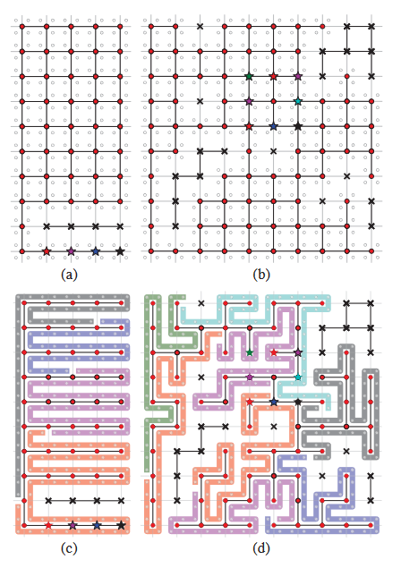

# MSTC*
## 问题描述
**地图描述：**

* **Covering Graph**; 
* **Spanning Graph** 

**问题定义**：
给定覆盖图$\mathcal{G}$和$k$个机器人，机器人$\mathcal{R_i}$的覆盖路径$\Pi_i$为$\mathcal{G}$中覆盖节点$\{\pi^j_i\}$的一个连续序列。对于机器人$\mathcal{R_i}$，其累积权重(cost)为$\mathcal{W_{\Pi_i}}$。定义mCPP问题如下：
$$\underset{\left\{\Pi_{i}\right\}}{\arg \min }\left(\max _{1 \leq i \leq k}\left(\mathcal{W}_{\Pi_{i}}\right)\right)$$
约束条件：
* 机器人$\mathcal{R_i}$拥有自己的库所(初始位置)；
* 机器人完成覆盖任务后返回各自的库所；
* 每个机器人的工作负荷能力有限，在其能量消耗完之前需要返回其库所。

### MSTC算法

## MSTC*算法
算法整体思想是将一个拓扑回路进行划分然后进行分配。分配如下：
$$\mathcal{P}=\left\{\pi_{\rho_{1}}^{*}, \pi_{\rho_{2}}^{*}, \ldots, \pi_{\rho_{k}}^{*}\right\}$$
其中，$\pi^*$表示两个分配之间的边界节点，$\rho_i$为每个分配的起始节点的索引。对于路径$\Pi_i$，其包含的节点如下：
$$\Pi_{i}=\left\{\pi_{\rho_{i}}^{*}, \pi_{\rho_{i}+1}, \pi_{\rho_{i}+2}, \ldots, \pi_{\rho_{i+1}-1}^{*}\right\}$$

分配过程：

仿真：

