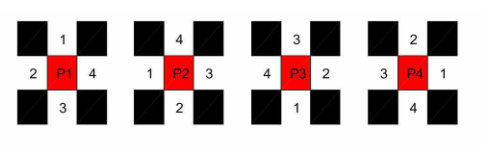

# A Multi-Robot Coverage Path Planning Method Based On Genetic Algorithm

**CPP definition：** "the coverage subject is a mobile robot or a fixed sensor, object is each reachable point in the target area, the method is physical interface or sensor perception, and the optimization objective is to simultaneously satisfy one or more of the shortest time, the least repeated path, and the highest coverage rate, etc."1

**Map Decompositon Methods:**
* Trapezoidal decompositon;
* Boutrophedon Cellular Decomposition(BCD);
* rectangular decomposion;

**Map Representation Methods:**
* grid method
* hex-decomposition method

**Contribution:**
1. 对地图环境的适应能力强；不限制机器人数量及其初始位置，对障碍物分布也无特殊要求；
2. 将遗传算法应用于MCPP；
3. 全覆盖且低重复率。

## 地图分解

总体思想：对地图栅格化后进行rectangular decomposition，对于分解后的地图再作部分子区域融合。

##  Move First(MF) pattern method

## 改进的遗传算法
**染色体(参数)编码方式：**

**优化目标函数：**
$$C = \alpha \cdot \max (l_i) + \beta \cdot \sum_{n}^{i=1}l_i$$

其中，$\alpha$和$\beta$为权重系数，$n$为机器人个数，$l_i$为机器人$i$的覆盖路径长度。优化目标为最小化目标函数$C$。

**适应度函数：**
$$F_p=\max(C)-C_p$$

**遗传操作设计：**
1. 改变子区域对应的机器人编号；
2. 更改子区域覆盖次序；
3. 改变子区域覆盖模式。

## 仿真结果

# Footnotes
[1] Merino, Luis, Fernando Caballero, J. Martínez-de-Dios, Ramiro Maza, and Iván Ollero. "An Unmanned Aircraft System for Automatic Forest Fire Monitoring and Measurement." Journal of Intelligent & Robotic Systems 65.1-4 (2012): 533-48.

[2] Avellar, Gustavo, Guilherme Pereira, Luciano Pimenta, and Paulo Iscold. "Multi-UAV Routing for Area Coverage and Remote Sensing with Minimum Time." Sensors 15.11 (2015): 27783-7803.

**hex-decomposition method**
[3] Kan, Xinyue, Hanzhe Teng, and Konstantinos Karydis. "Online Exploration and Coverage Planning in Unknown Obstacle-Cluttered Environments." IEEE Robotics and Automation Letters 5.4 (2020): 5969976.