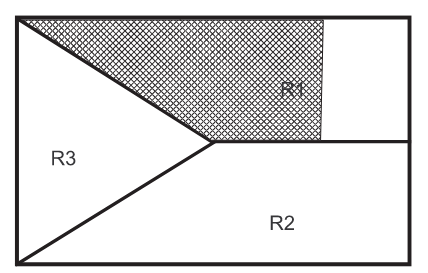
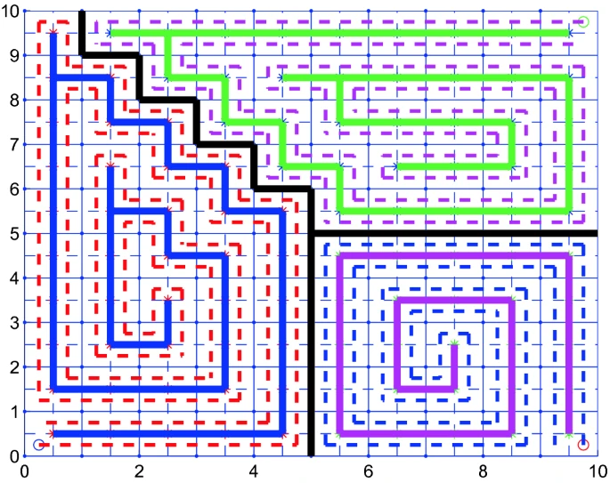
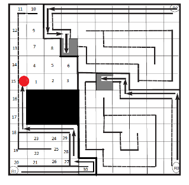

# Nair_multirobot_unknown_exploration_coverage

## 问题描述

场景特点：bounded and contiguous workspace with known boundaries; unknown obstacles; 需要动态调节区域划分以应对机器人的故障

## 方法

基于曼哈顿距离的Voronoi划分的CPP方法

应对单个机器人故障

* 重划分

R1故障后

* 替补

