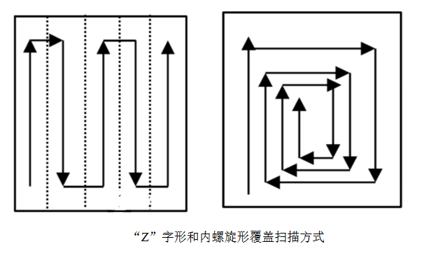
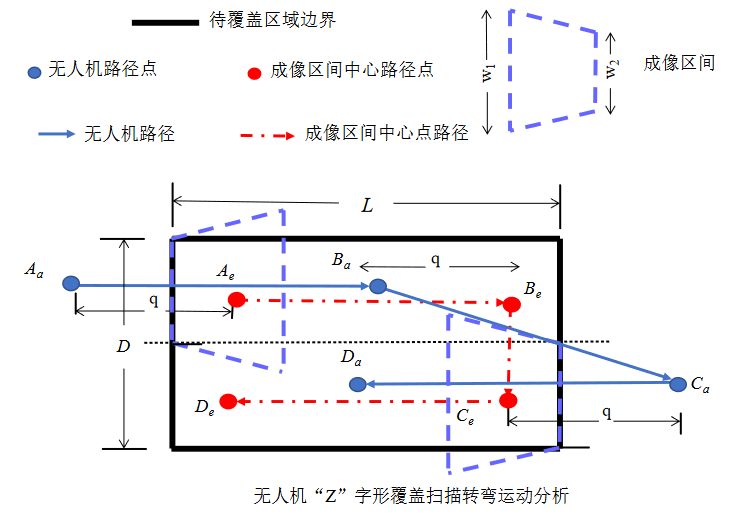

# 最短任务时长的多无人机协同全覆盖路径规划方法
* 多无人机协同覆盖问题：
1. 对代覆盖区域进行合理的区域分割；
2. 子区域内进行单无人机覆盖扫描路径规划；
3. 根据多无人及的能力大小对子区域进行合理的分配。

## 多无人机协同覆盖问题建模

### 无人机区域覆盖路径规划方法
**无人机覆盖扫描航机规划运动方式：**

**路径转弯对无人机覆盖效率的影响：**

由于无人及投影与相机足迹中心点不一致，导致无人机在扫描边界时，应飞出边界进行转弯掉头，以防止待覆盖区域的成像不完整。因此在路径规划中，应尽量减少无人机的转弯次数，即可有效减少超出边界的无效扫描路径，提升覆盖效率。

**路径规划方法：**
凸多边形的跨度与宽度：

* 对于一个凸多边形区域的覆盖路径规划，无人机覆盖路径的转弯次数N只与该凸多边形的跨度有关：
$$N_{turn} = <D/w>$$
* 沿着凸多边形宽度的支撑线方向为最佳覆盖扫面方向。

* 不同的进出口模式对总路径

## 区域分割方法

## 子区域的任务分配问题